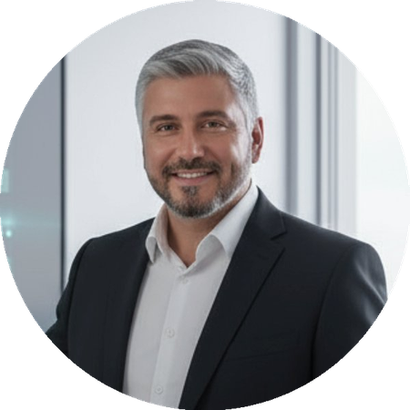
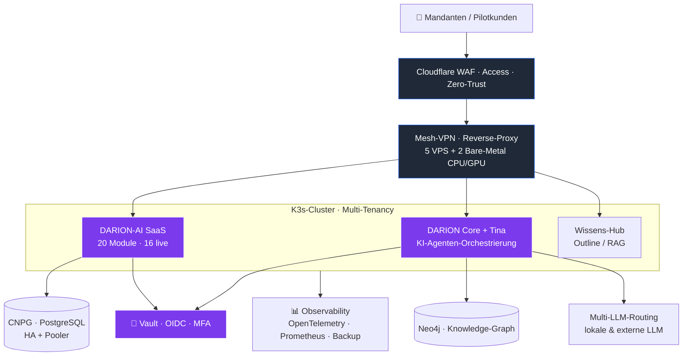

# Frank Wichert

*DARC Management UG · Gevelsberg*

---

## Über mich

Erfahrener Manager mit **20-jähriger Führungspraxis**, Interim- und Projektmanager mit über **80 Mandaten in 15+ Branchen**. Sparringspartner und Mentor, Keynote Speaker — zielgerichtet, transparent und durchsetzungsstark. Erfahrung im nationalen und internationalen Umfeld (DACH, Spanien, Dubai), in KMU, Konzernen und Familienunternehmen.

Als ehemaliger Soldat auf Zeit (12 Jahre) verbinde ich operative Klarheit mit strategischer Tiefe. Schwerpunkte: **Sanierung, Stabilisierung, Vakanzüberbrückung** sowie **Digitalisierung, AI/KI, Cyber-Security, KRITIS/NIS 2.0** und **M&A für IT**.

| 80+ | 20+ | 15+ | 120+ |
|:---:|:---:|:---:|:---:|
| **Mandate** | **Jahre Führung** | **Branchen** | **Mitarbeiter als CIO** |

---

## Architektur im Überblick

> *Souveräne, mandantenfähige Plattform — IT-Sicherheit und Compliance als Fundament, nicht als Nachgedanke.*

> 📐 **Vertiefung:** [**darion-architecture**](https://github.com/frank-wichert/darion-architecture) — öffentliche Architektur-Vitrine mit Diagramm, Bausteinen und Sicherheits-Prinzipien.

---

## Aktuelle DARC-Eigenentwicklungen — seit 08/2024

> *Seit Q3 2024 baue ich als Lead Architect mit einem Kernteam (zwei Entwickler plus AI-Pair-Programming) produktive Plattformen und Infrastruktur-Bausteine auf. Eigenentwicklung mit Pilotkunden, Multi-Tenancy als Fundament, IT-Sicherheit und Compliance von Beginn an mitgedacht.*

| # | Projekt | Beschreibung | Status | Tech-Stack |
|---|---------|--------------|--------|------------|
| 1 | **DARION-AI — Multi-Tenant SaaS** | Modulare Business-Suite mit 20 Fachmodulen, davon 16 verfügbar (u. a. Finanzen, HR, Vertrieb, Projekte/PSA, Verträge, E-Rechnung, Zeiterfassung, IT-Management, DMS, Wissen, ISMS, DSGVO-Compliance), 4 im Ausbau; Multi-LLM-Routing, RAG-Layer, Live-Cockpit, CNPG-HA mit Pooler, CI/CD ≥80 % Coverage | Launch 18.08.2026 | FastAPI · Next.js 15 · K3s · CloudNativePG · LLM-API · RAG · OpenTelemetry |
| 2 | **Zentrale Coding-Plattform (Tina)** | Orchestrierte, autonome Software-Entwicklung mit Gewaltenteilung: lokale Code-Modelle bauen tier-basiert, ein unabhängiges Review-Modell prüft jeden Beitrag, Merge nur über Draft-PR (kein Auto-Merge). Plan-/Critic-/Recall-Rollen, Lern-Loop, 64k-Coder-Kontext | Pilot-Loop produktiv | Temporal · vLLM · MCP · Catalyst |
| 3 | **DARION Core — Agenten-Orchestrierung** | Mixture-of-Agents-Framework mit Plan-, Critic-, Recall-Agent und Orchestrator; Unified Query Hub (6 Routen), Knowledge-Graph, 176 grüne Tests | 6 Phasen produktiv | LiteLLM · Graphiti · Neo4j · MCP · Langfuse |
| 4 | **Wissens-Architektur & Self-Hosted-Wiki** | Souveräner Knowledge-Hub auf Outline (docs.darion-ai.tech) mit SSO und Federation zum Agenten-Wissensspeicher | Produktiv | Outline · Keycloak · Cloudflare Access · PostgreSQL · MinIO |
| 5 | **KI-Governance — Supporter ⇄ Assistenz** | Hart getrennte interne KI-Rollen nach Least-Privilege (ERP-Supporter ohne Dokumente vs. need-to-know-RAG-Assistenz), durchgesetzt in der DB statt im Prompt, EU-AI-Act-konform | Konzept build-ready | PostgreSQL RLS · JWT · RAG · EU AI Act Art. 50 · Redact-before-Embed |
| 6 | **Identity-, Geheimnis- & Schlüssel-Management** | Dualer Vault-Ansatz mit zweiter Vertrauenslinie, dokumentiertem Schlüssel-Lebenszyklus, Service-Accounts und scoped-Token-Minting | In Betrieb | Vaultwarden · 1Password · OIDC · MFA · TLS · Append-Only |
| 7 | **Server-Cluster mit Mesh-VPN & Tenant-Isolation** | Flotte (5 VPS + 2 Bare-Metal CPU/GPU) mit Mesh-VPN, mehrschichtiger Firewall (DOCKER-USER-Layer), Reverse-Proxy, Cloudflare WAF, einheitlichem Hardening; inkl. Domain-Migration .de → .tech (6 Subdomains) | In Betrieb | Bare-Metal & VPS · Netbird · WireGuard · Cloudflare WAF · K3s · Caddy |
| 8 | **Configuration-Management & Provisionierung** | Zentrales Inventory aller Mesh-Knoten, idempotente Playbooks (Hardening, SSH, Fail2Ban, Backup), Dry-Run-Workflow mit grüner Verifikation | Phase 5 | Ansible · YAML · Jinja2 · Vault-Lookup · Git |
| 9 | **E2EE-Messaging-Migration** | Vollständige Ablösung von Telegram durch self-hosted Matrix mit Cross-Signing, gehärteter Webhook-API mit Themenkanälen, bewusster Federations-Reduktion | Phasen 1–4 fertig | Matrix-Synapse · Element · matrix-nio · Olm/Megolm · Cross-Signing |
| 10 | **Backup-, Monitoring- & Observability-Stack** | Append-Only-Backup mit Restore-Verifikation und Offsite-Kopie; Live-Cockpit (SSE) für Fleet-Health, LLM-Spend, Backup-Status, Heartbeat; node_exporter-Flottenabdeckung | In Betrieb | restic · SFTP · PostgreSQL · OpenTelemetry · Prometheus · SSE |
| 11 | **Job-Discovery- & Lead-Enrichment-Pipeline** | Mehrquellige Pipeline (Apollo, SerpAPI, BA) mit RAG-Sync, Cross-Host-Review-Oberfläche, regelbasierter Auto-Klassifikation (>85 %) plus LLM-Restmenge | In Betrieb | FastAPI · PostgreSQL · Apollo · SerpAPI · BA-API · AnythingLLM |
| 12 | **DARC-Funnel & Marketing-Properties** | Eigenständige Marketing-Sites (darc-transform.de, darion-ai.de/.tech) plus Lead-Funnel mit Selbstcheck-Logik und CRM-Anbindung | Live | Next.js · Hostinger · Cloudflare · Docker Swarm · CRM-Intake |
| 13 | **DARC System — Reifegrad-Check & Strategie-Workshop** | Geführtes Self-Assessment für Digitalisierung, KI und Compliance: 8 Module über 3 Ebenen (inkl. „Führung mit KI"), Reifegrade 0–4, optionaler NIS-2/KRITIS-Betroffenheits-Check, automatisch erzeugter PDF-Report mit RACI- und Schichtenmodell; begleitender Strategie-Workshop zur Ergebnis-Einordnung und Maßnahmen-Roadmap | Launch-bereit | Python · WeasyPrint · YAML · GPG · PDF |
| 14 | **Wissens-gestützte KI-Assistenten — RAG ohne Halluzination** | Chat- und Assistenz-Bots, die ausschließlich aus dem souveränen Wissensspeicher antworten (RAG über pgvector/BGE-M3 + Knowledge-Graph statt Modell-Wissen); Grounding mit „Weiß-ich-nicht"-Fallback statt Raten, plus Dual-LLM/CaMeL-Leitplanken gegen Prompt-Injection und Daten-Poisoning | In Betrieb | RAG · pgvector · BGE-M3 · Neo4j · Dual-LLM/CaMeL · LiteLLM |
| 15 | **DARION-AI — Souveräne Cloud-Migration & HA-Betrieb** | Verlagerung der kompletten DARION-AI-Umgebung auf eine souveräne, deutsche Cloud: Konsolidierung auf 3 hochverfügbare Kubernetes-Cluster (keine Single-Server), GitOps, verschlüsselte WORM-Backups (Object-Lock, dual-region), gesicherter und **verlustfreier** Cutover je Domäne. Gesichert und nachhaltig von Tag 1. → **[Planung, Durchführung & Tests](./projekte/darion-ai-cloud-migration.md)** | Konzept abgeschlossen | RKE2 · Cilium · ArgoCD · CloudNativePG · Terraform · Velero · OpenTelemetry · Kyverno |
| 16 | **DARION-AI Meetings — native Meetings & Transkription** | In die Plattform integriertes Meetings-Modul mit Live-Audio/Video, Aufzeichnung sowie automatischer Transkription und Zusammenfassung, souverän ohne US-Dienste | Im Ausbau | LiveKit · Whisper · Qwen3 · Next.js · PostgreSQL |

---

## 🧩 DARC-Produktfamilie

> Neben DARION-AI betreibt die DARC Management UG weitere Produkte.

| Produkt | Zusammenfassung | Mehrwert | Status |
|---------|-----------------|----------|--------|
| **[DARC One](https://darc-transform.de/darc-one/)** | Souveräner, self-hosted KI-Assistent für den regulierten Mittelstand (Kanzleien, Praxen, Versicherungsvermittler), erreichbar per Telefon, Web-Chat und Matrix | Compliance als technische Eigenschaft statt Dokumentation: Governance-Gate vor jeder Aktion, belegte Auskünfte statt Halluzination, signiertes Audit-Log, Read-only-Konnektoren (z. B. DATEV), Human-in-the-Loop, EU-AI-Act-konform ab Tag 1 | Live |
| **DARC Suite** | Self-hosted Business-Suite für KMU mit CRM, Projekten, HR, Recruiting und Rechnungsstellung, betrieben und gehärtet auf eigener Infrastruktur in Deutschland | Deckt die operativen Kernprozesse vom Vertrieb bis zur Faktura in einer souveränen Umgebung ohne US-Cloud ab, mit gehärtetem Betrieb (Least-Privilege, Backups, Monitoring) | In Betrieb |
| **DARC System** | Geführter Reifegrad-Check für Digitalisierung, KI und Compliance (8 Module über 3 Ebenen) mit automatischem PDF-Report und begleitendem Strategie-Workshop | Objektive Standortbestimmung inkl. NIS-2/KRITIS-Betroffenheit und konkreter Maßnahmen-Roadmap statt Bauchgefühl | Launch-bereit |

---

## 📂 Alle Projekte & Referenzen

> **Über 80 Projekte in mehr als 20 Jahren.** Der vollständige, durchsuchbare Katalog bündelt die DARC-Eigenentwicklungen und rund 30 Interim-Referenzmandate (Gesundheitswesen, Öffentlicher Sektor, Automotive, Logistik, Pharma, Energie u. v. m.) sowie Bundeswehr und UAV. Nach **Jahr, Branche und Technologie** durchsuchbar.
>
> ### → [**Zum Projekt- & Referenz-Katalog**](./projekte/)

---

## Tech-Stack

**Sprachen & Runtime**

**Backend & Frontend**

**Daten & Vektor-Stores**

**KI & LLM-Ops**

**Cloud · Kubernetes · IaC**

**Observability**

**Security & Identity**

**Kommunikation & Tooling**

---

## IT-Sicherheit & Compliance

> *Querschnitt über alle Projekte — von Beginn an mitgedacht.*

**Operative Säulen:** Vault & Schlüssel-Lifecycle · Append-Only-Backup · Mesh-VPN-Default · E2EE-Kommunikation

---

## 🎤 Keynote Speaker

Vorträge und Keynotes zu KI, Digitalisierung und Führung — u. a. bei den **AI Days 2026 Frankfurt** („Warum KI nicht ohne den Menschen funktioniert").

**Themenfelder:** KI im Mittelstand · Digitale Transformation · Führung in der Krise · Souveräne KI & NIS 2.0

---

## Branchen-Erfahrung

Automotive & Zulieferer · Gesundheit, Kliniken, Versicherungen · Logistik & Schienenverkehr · Behörden & Rüstung · E-Commerce · Hotel & Gastgewerbe · Pharmaindustrie & Chemie · Öffentlicher Sektor · Telekommunikation

---

## Kontakt

| | |
|---|---|
| **DARC Management UG** | Gewerbestr. 37a · 58285 Gevelsberg |
| **Telefon** | 02332 9994020 |
| **E-Mail** | [frank.wichert@darc-mgt.de](mailto:frank.wichert@darc-mgt.de) |
| **Web** | [darc-transform.de](https://darc-transform.de) · [darion-ai.de](https://darion-ai.de) |
| **LinkedIn** | [linkedin.com/in/frank-wichert-5b0017294](https://www.linkedin.com/in/frank-wichert-5b0017294/) |
| **Verfügbarkeit** | 48h einsatzbereit |

---

*DARC · Digital. Agile. Results. Consulting.*

